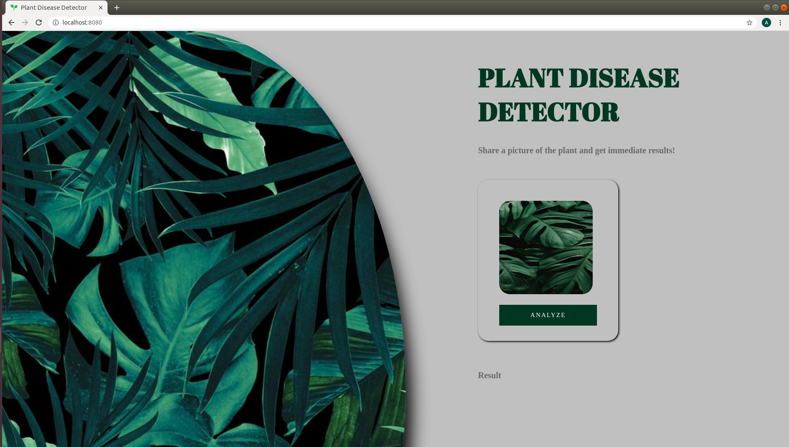

## Plant Disease Detector 2.0
<br>


Models are trained on the preprocessed dataset which can be downloaded [here](https://drive.google.com/open?id=0B_voCy5O5sXMTFByemhpZllYREU).

## Local Set-Up
### Local:
- It is recommended to set up the project inside a virtual environment to keep the dependencies separated.
    * [Python](https://realpython.com/python-virtual-environments-a-primer/#why-the-need-for-virtual-environments)
    * [Conda](https://docs.conda.io/projects/conda/en/latest/user-guide/tasks/manage-environments.html)
- Activate your virtual environment.
- Install dependencies by running `pip install -r requirements.txt`.
- Start up the server by running `python app/server.py serve`.
- Visit <http://localhost:8080/> to explore and test.

### Docker:
*Make Sure the Docker is installed in your local Machine. [Click Here](https://docs.docker.com/install/) to know that how to install Docker*.
- **Mac:**
  ```bash
  $ git clone 
  $ cd Plant_Disease_Detection
  $ docker build -t fastai-v3 .
  $ docker run --rm -it -p 8080:8080 fastai-v3
  ```
  **Go to http://localhost:8080/ to test your app.**

- **Windows:**
  ```PowerShell or Command Prompt
  $ git clone 
  $ cd Plant_Disease_Detection
  $ docker build -t fastai-v3 .
  $ docker run --rm -it -p 8080:8080 fastai-v3
  ```
  **Go to http://localhost:8080/ to test your app.**

  **Note:** Windows 10 Pro required.

- **Linux:**
  ```Terminal
  $ git clone 
  $ cd Plant_Disease_Detection
  $ docker build -t fastai-v3 .
  $ docker run --rm -it -p 8080:8080 fastai-v3
   ```
   **Note:** If this doesn't work use `--no-cache` flag in the build command.

  **Go to http://localhost:8080/ to test your app.**

